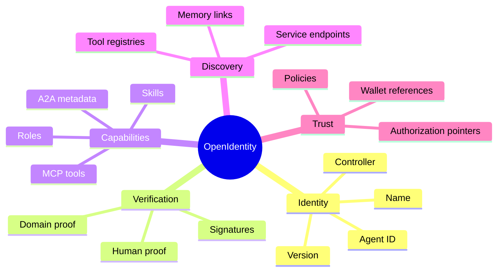
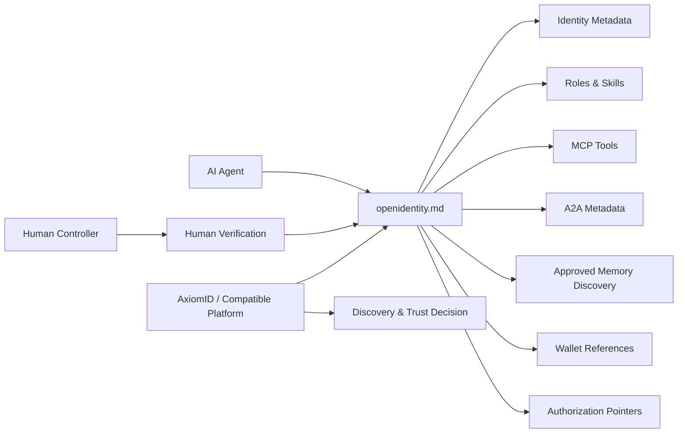

<div align="center">

# OpenIdentity | الهوية المفتوحة

### The Discovery Layer for AI Agent Identity  
### طبقة الاكتشاف لهوية وكلاء الذكاء الاصطناعي

[](#openidentity-manifest)
[](spec/openidentity-v0.1.md)
[](schema/openidentity.schema.json)
[](https://axiomid.app/)
[](#arabic--العربية)

**OpenIdentity is a portable identity manifest for AI agents. It combines identity, human verification, roles, skills, MCP tools, A2A metadata, memory discovery links, wallet references, and authorization pointers into one secure, shareable file.**

**OpenIdentity هو ملف هوية محمول لوكلاء الذكاء الاصطناعي، يجمع الهوية، التحقق البشري، الأدوار، المهارات، أدوات MCP، بيانات A2A، روابط اكتشاف الذاكرة، مراجع المحافظ، ومؤشرات التفويض في ملف واحد آمن وقابل للمشاركة.**

</div>

---

## Positioning | الرسالة

> **Short version:** OpenIdentity is the discovery layer for AI agent identity.

> **USB metaphor:** Like a USB descriptor for an AI agent, OpenIdentity lets any compatible platform understand what the agent is, who controls it, what it can do, and where its approved memory and tools live.

> **النسخة المختصرة:** OpenIdentity هي طبقة الاكتشاف لهوية وكلاء الذكاء الاصطناعي.

> **تشبيه USB:** مثل واصف USB لوكيل ذكاء اصطناعي، يتيح OpenIdentity لأي منصة متوافقة فهم ماهية الوكيل، ومن يتحكم به، وما يمكنه فعله، وأين توجد ذاكرته وأدواته المعتمدة.

OpenIdentity is designed to work well inside [AxiomID](https://github.com/Moeabdelaziz007/AxiomID) and the [AxiomID app](https://axiomid.app/) as a practical, portable manifest layer for agent discovery and trust.


---

## Founder & Creator | المؤسس والمبتكر

OpenIdentity was founded and created by [Moe Abdelaziz](https://github.com/Moeabdelaziz007).

تم تأسيس وإنشاء OpenIdentity بواسطة [Moe Abdelaziz](https://github.com/Moeabdelaziz007).

---

## Repository Map | خريطة المستودع

```text
openidentity.md/
  README.md
  ROADMAP.md
  agentic.md
  agentic.txt
  frontend/
    index.html
    styles.css
    app.js
  i18n/
    en.json
    ar.json
  scripts/
    build_agentic_index.py
    providers/
      deploy_how_now.sh
      ghost_schema.sql
  .github/
    repository-settings.md
    workflows/validate.yml
  docs/deploy/
    vercel.md
    deployment-status.md
  docs/services/
    how-now-ghost.md
  dist/
    agentic-index.json
  spec/
    openidentity-v0.1.md
  schema/
    openidentity.schema.json
  examples/
    openidentity.md
    minimal.openidentity.md
    full.openidentity.md
  docs/
    landing-page.md
    mvp-poc-use-cases.md
    indexing/
      agentic-indexing.md
    security.md
    memory-discovery.md
    verification.md
```

| Path | Purpose | الهدف |
|---|---|---|
| `README.md` | Project positioning and quick start | التعريف بالمشروع والبدء السريع |
| `ROADMAP.md` | Product and standards roadmap | خارطة طريق المنتج والمعيار |
| `agentic.md` / `agentic.txt` | Agent-facing discovery indexes | فهارس اكتشاف موجهة للوكلاء |
| `frontend/` | Static bilingual UI prototype with light/dark mode | نموذج واجهة ثابت ثنائي اللغة مع وضع فاتح/داكن |
| `i18n/` | Translation seed files for English and Arabic | ملفات ترجمة أولية للعربية والإنجليزية |
| `scripts/build_agentic_index.py` | Builds `dist/agentic-index.json` for discovery | ينشئ فهرس الاكتشاف `dist/agentic-index.json` |
| `.github/repository-settings.md` | GitHub description, topics, About, and branch-protection checklist | إعداد وصف GitHub والوسوم والحماية |
| `docs/deploy/vercel.md` | Vercel deployment instructions and expected URL pattern | تعليمات النشر على Vercel ونمط الرابط المتوقع |
| `docs/services/how-now-ghost.md` | How.now hosting and Ghost database integration plan | خطة تكامل How.now للاستضافة وGhost لقاعدة البيانات |
| `spec/openidentity-v0.1.md` | Human-readable v0.1 specification | مواصفة v0.1 قابلة للقراءة |
| `schema/openidentity.schema.json` | JSON Schema for validation | مخطط JSON للتحقق |
| `examples/` | Minimal, standard, and full manifests | أمثلة مختصرة وقياسية وكاملة |
| `docs/landing-page.md` | AxiomID landing page content and design blueprint | محتوى وتصميم صفحة هبوط AxiomID |
| `docs/mvp-poc-use-cases.md` | MVP, proof-of-concept, use cases, and consent-first growth | المنتج الأولي وإثبات المفهوم وحالات الاستخدام والنمو بالموافقة |
| `docs/indexing/agentic-indexing.md` | Indexing model, rules, metadata, and script workflow | نموذج الفهرسة والقواعد والبيانات وسير عمل السكربت |
| `docs/security.md` | Security model and threat notes | نموذج الأمان والتهديدات |
| `docs/memory-discovery.md` | Approved memory discovery patterns | أنماط اكتشاف الذاكرة المعتمدة |
| `docs/verification.md` | Human and controller verification | التحقق من الإنسان والمتحكم |

---

<a id="openidentity-manifest"></a>

## What Goes Inside an OpenIdentity Manifest?



An `openidentity.md` file is intentionally portable and readable. Platforms can render it for humans, parse it for machines, validate it with JSON Schema, and use it as a trust bootstrap document.

---

## Quick Start | البدء السريع

1. Copy `examples/minimal.openidentity.md` into your agent or platform repository.
2. Fill in identity, controller, verification, roles, skills, tools, and memory discovery links.
3. Validate structured fields against `schema/openidentity.schema.json`.
4. Publish the file at a stable URL, repository path, or AxiomID profile.
5. Use the manifest as the first discovery document when another platform needs to understand the agent.

```bash
python3 -m json.tool schema/openidentity.schema.json >/dev/null
```

---

## Architecture | البنية المعمارية



---


## AxiomID MVP Landing Page | صفحة هبوط AxiomID للمنتج الأولي

AxiomID should present OpenIdentity as an enterprise-grade identity and trust surface for the agentic era: polished like Apple, searchable like Google, developer-native like Vercel, and visually energetic like modern agentic AI products. The recommended page architecture is documented in [`docs/landing-page.md`](docs/landing-page.md).

تقدم AxiomID مشروع OpenIdentity كواجهة هوية وثقة مؤسسية لعصر الوكلاء: واضحة مثل Apple، قابلة للبحث مثل Google، صديقة للمطورين مثل Vercel، وبطاقة بصرية تناسب منتجات الذكاء الاصطناعي الوكيلية الحديثة. تم توثيق بنية الصفحة المقترحة في [`docs/landing-page.md`](docs/landing-page.md).

### Agentic Protocol Marketing Strip

Use recognizable protocol badges and logo slots as a trust-building marketing pattern:

| Protocol / Pattern | Marketing role | دورها التسويقي |
|---|---|---|
| 🧩 MCP | Tool and server interoperability | قابلية تشغيل الأدوات والخوادم |
| 🤝 A2A | Agent-to-agent handoffs | انتقالات آمنة بين الوكلاء |
| 🪪 DID + Verifiable Credentials | Portable identifiers and signed claims | معرفات محمولة وادعاءات موقعة |
| 🔐 OAuth 2.0 + OpenID Connect | Delegated authorization and login trust | تفويض وتسجيل دخول موثوق |
| 💳 Wallet / SIWE / CAIP | Wallet ownership and account references | ملكية المحافظ ومراجع الحسابات |
| 📄 LLMs.txt + agentic.txt | Indexing and AI crawler discovery | الفهرسة واكتشاف وكلاء الذكاء الاصطناعي |

### MVP, POC, and Use Cases

The MVP should focus on consent-first profile creation, bilingual rendering, light/dark mode, manifest validation, search, verification states, protocol badges, access-request flows, and the static frontend prototype in [`frontend/index.html`](frontend/index.html). The full proof-of-concept journey, enterprise use cases, and ethical growth model are documented in [`docs/mvp-poc-use-cases.md`](docs/mvp-poc-use-cases.md).

يركز المنتج الأولي على إنشاء الملفات بالموافقة، العرض بالعربية والإنجليزية، الوضع الفاتح والداكن، التحقق من الملفات، البحث، حالات التحقق، شارات البروتوكولات، ومسارات طلب الوصول. تم توثيق رحلة إثبات المفهوم وحالات الاستخدام المؤسسية ونموذج النمو الأخلاقي في [`docs/mvp-poc-use-cases.md`](docs/mvp-poc-use-cases.md).


### Agentic Services: How.now + Ghost

AxiomID can use How.now as the requested agentic hosting target for the bilingual frontend and public discovery files, while Ghost can provide an agent-native Postgres layer for profiles, verification states, access requests, discovery events, and audit metadata. The service architecture, schema, environment variables, and deploy flow are documented in [`docs/services/how-now-ghost.md`](docs/services/how-now-ghost.md).

يمكن لـ AxiomID استخدام How.now كهدف استضافة وكيلي للواجهة ثنائية اللغة وملفات الاكتشاف العامة، واستخدام Ghost كطبقة Postgres موجهة للوكلاء لتخزين الملفات وحالات التحقق وطلبات الوصول وأحداث الاكتشاف وبيانات التدقيق.

### Deployment and GitHub Setup

The frontend is deploy-ready for Vercel through [`vercel.json`](vercel.json) and the npm scripts in [`package.json`](package.json). Use [`docs/deploy/vercel.md`](docs/deploy/vercel.md) for setup, and use [`.github/repository-settings.md`](.github/repository-settings.md) to configure the GitHub repository description, website URL, topics/tags, branch protection, Issues, and Discussions. The latest deployment attempt/status is tracked in [`docs/deploy/deployment-status.md`](docs/deploy/deployment-status.md).

تم تجهيز الواجهة للنشر على Vercel عبر [`vercel.json`](vercel.json) وسكربتات [`package.json`](package.json). استخدم [`docs/deploy/vercel.md`](docs/deploy/vercel.md) للنشر، و[`.github/repository-settings.md`](.github/repository-settings.md) لإعداد وصف المستودع والوسوم والحماية وIssues وDiscussions.

### Agent Discovery Indexes

This repository now includes [`agentic.md`](agentic.md), [`agentic.txt`](agentic.txt), [`docs/indexing/agentic-indexing.md`](docs/indexing/agentic-indexing.md), and [`dist/agentic-index.json`](dist/agentic-index.json) so AI agents, crawlers, and enterprise platforms can quickly discover the project purpose, important documents, supported protocols, preferred behavior, and safety constraints. Run `python3 scripts/build_agentic_index.py` after documentation changes to refresh the generated index.

---

## English

### Core Use Cases

- Let platforms discover an AI agent's identity and controller.
- Publish approved roles, skills, and MCP tool references.
- Point to authorized memory locations without leaking private memory content.
- Attach human verification, wallet, domain, or signature references.
- Provide A2A metadata so agents and platforms can safely interoperate.
- Create a portable manifest that works across GitHub, AxiomID, websites, and agent runtimes.

### Design Principles

| Principle | Meaning |
|---|---|
| Portable | A manifest should travel with the agent across platforms. |
| Human-readable | Markdown is the canonical presentation format. |
| Machine-parseable | Structured blocks can be validated and indexed. |
| Secure by reference | Sensitive resources are referenced, not embedded. |
| Consent-first | Memory, wallets, and tools should be explicitly approved. |
| Interoperable | The format should support MCP, A2A, wallets, and authorization systems. |

---

<a id="arabic--العربية"></a>

## العربية

### حالات الاستخدام الأساسية

- تمكين المنصات من اكتشاف هوية وكيل الذكاء الاصطناعي والمتحكم به.
- نشر الأدوار والمهارات ومراجع أدوات MCP المعتمدة.
- الإشارة إلى مواقع الذاكرة المصرح بها دون كشف محتوى الذاكرة الخاصة.
- ربط مراجع التحقق البشري أو النطاق أو المحفظة أو التوقيعات.
- توفير بيانات A2A لتشغيل آمن بين الوكلاء والمنصات.
- إنشاء ملف محمول يعمل عبر GitHub وAxiomID والمواقع الإلكترونية وبيئات تشغيل الوكلاء.

### مبادئ التصميم

| المبدأ | المعنى |
|---|---|
| قابلية النقل | يجب أن ينتقل ملف الهوية مع الوكيل عبر المنصات. |
| قابلية القراءة | Markdown هو تنسيق العرض الأساسي للبشر. |
| قابلية الفهم آلياً | يمكن التحقق من الكتل المنظمة وفهرستها. |
| الأمان بالإشارة | يتم استخدام مراجع للموارد الحساسة بدلاً من تضمينها. |
| الموافقة أولاً | الذاكرة والمحافظ والأدوات يجب أن تكون معتمدة بوضوح. |
| قابلية التشغيل البيني | يدعم التنسيق MCP وA2A والمحافظ وأنظمة التفويض. |

---

## Example Manifest Preview

```yaml
openidentity: "0.1"
agent:
  id: "did:web:example.com:agents:axiom-assistant"
  name: "Axiom Assistant"
  type: "ai-agent"
controller:
  human:
    name: "Example Controller"
    verification: "https://axiomid.app/u/example"
capabilities:
  roles: ["research", "workflow-automation"]
  skills: ["identity-discovery", "memory-routing"]
discovery:
  memory:
    - label: "approved-public-memory"
      uri: "https://example.com/memory/index.json"
      access: "public-read"
```

See [`examples/openidentity.md`](examples/openidentity.md), [`examples/minimal.openidentity.md`](examples/minimal.openidentity.md), and [`examples/full.openidentity.md`](examples/full.openidentity.md) for complete examples.

---

## Status

OpenIdentity v0.1 is an early draft intended for experimentation, feedback, AxiomID integration, and interoperability discussion.

