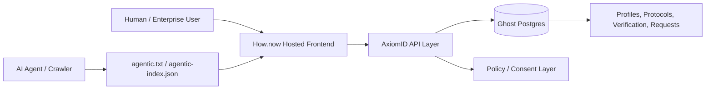

# How.now Hosting + Ghost Database Plan | خطة How.now و Ghost

This repository is prepared for an agentic-services deployment path where:

- **How.now** is the preferred agentic hosting target requested for the AxiomID/OpenIdentity frontend.
- **Ghost** (`ghost.build`) is the preferred agent-native Postgres database layer for profile indexing, discovery metadata, access requests, pilot workspaces, and audit/event storage.

> Note: How.now deployment commands and environment variables should be replaced with the official provider values from the project dashboard or CLI. This document intentionally avoids hard-coding unverified provider-specific commands.

## Service Architecture



## Recommended Responsibilities

| Layer | Service | Responsibility |
|---|---|---|
| Frontend hosting | How.now | Static AxiomID landing page, bilingual UI, docs links, discovery files |
| Agent database | Ghost | Postgres-backed storage for profiles, discovery index, access requests, audit events |
| Discovery files | Repo + hosted frontend | `agentic.txt`, `agentic.md`, `agentic-index.json`, optional `llms.txt` |
| CI/CD | GitHub Actions | Validate JSON, build indexes, smoke-test frontend |
| Fallback hosting | Vercel | Optional fallback if How.now deployment is unavailable |

## Ghost Database Tables for MVP

```sql
create table if not exists profiles (
  id text primary key,
  display_name text not null,
  controller_type text not null,
  manifest_url text not null,
  verification_state text not null default 'self-attested',
  languages text[] not null default array['en'],
  protocols text[] not null default array[]::text[],
  created_at timestamptz not null default now(),
  updated_at timestamptz not null default now()
);

create table if not exists access_requests (
  id uuid primary key default gen_random_uuid(),
  profile_id text references profiles(id),
  requester_email text not null,
  requested_resource text not null,
  consent_marketing boolean not null default false,
  status text not null default 'pending',
  created_at timestamptz not null default now()
);

create table if not exists discovery_events (
  id uuid primary key default gen_random_uuid(),
  profile_id text,
  event_type text not null,
  source text,
  metadata jsonb not null default '{}'::jsonb,
  created_at timestamptz not null default now()
);
```

## Environment Variables

Use `.env.example` as the canonical local/CI reference.

| Variable | Purpose |
|---|---|
| `HOW_NOW_PROJECT` | How.now project slug or app id |
| `HOW_NOW_TOKEN` | CI deploy token for How.now |
| `HOW_NOW_URL` | Confirmed production URL after deployment |
| `GHOST_DATABASE_URL` | Ghost Postgres connection string |
| `GHOST_BRANCH` | Optional branch/fork/database name for ephemeral agent work |
| `AXIOMID_PUBLIC_URL` | Public canonical URL for the AxiomID frontend |

## Deployment Flow

1. Build the machine-readable discovery index:

```bash
python3 scripts/build_agentic_index.py
```

2. Run local validation:

```bash
npm run check
```

3. Deploy to How.now using provider credentials:

```bash
HOW_NOW_TOKEN=... HOW_NOW_PROJECT=openidentity-md ./scripts/providers/deploy_how_now.sh
```

4. Provision or connect Ghost database credentials:

```bash
GHOST_DATABASE_URL=postgres://... ./scripts/providers/ghost_schema.sql
```

5. Confirm the live URL and set `HOW_NOW_URL` / `AXIOMID_PUBLIC_URL` in CI and repository settings.

## Agentic Discovery Requirements

The hosted frontend should expose these public files at stable URLs:

- `/agentic.txt`
- `/agentic.md`
- `/agentic-index.json`
- `/openidentity.md` when a concrete profile is hosted
- `/llms.txt` if a curated LLM crawler index is added

## Arabic Summary | ملخص عربي

تم تجهيز المستودع لمسار نشر يعتمد على **How.now** للاستضافة و **Ghost** كقاعدة بيانات Postgres موجهة للوكلاء. يجب استخدام How.now لاستضافة الواجهة وملفات الاكتشاف، واستخدام Ghost لتخزين ملفات الهوية، حالات التحقق، طلبات الوصول، وأحداث الفهرسة مع احترام الخصوصية والموافقة.
